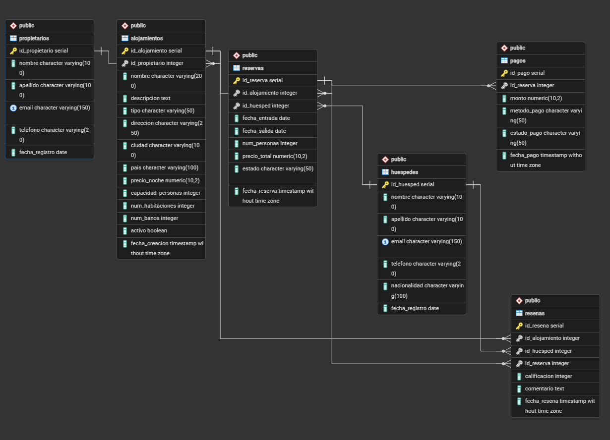

# Sistema de Gestión de Alojamientos Turísticos 🏨✈️

Este proyecto contiene el diseño e implementación de una base de datos relacional orientada a la gestión de alojamientos turísticos, reservas, huéspedes, pagos y reseñas.

## 🛠️ Tecnologías Utilizadas

* **Motor de Base de Datos:** PostgreSQL (v18 o superior recomendada)
* **Herramienta de Administración:** pgAdmin 4

---

## 📐 Esquema de la Base de Datos

La base de datos se compone de 6 tablas principales relacionadas mediante llaves foráneas

### 1. Tabla: `propietarios`
Almacena la información de las personas que ponen en alquiler sus propiedades.
* `id_propietario` (SERIAL, PK): Identificador único del propietario.
* `nombre` (VARCHAR): Nombre del propietario.
* `apellido` (VARCHAR): Apellido del propietario.
* `email` (VARCHAR, UNIQUE): Correo electrónico único de contacto.
* `telefono` (VARCHAR): Número de teléfono.
* `fecha_registro` (DATE): Fecha de registro en la plataforma (Por defecto la fecha actual).

### 2. Tabla: `alojamientos`
Contiene el catálogo de propiedades disponibles para rentar.
* `id_alojamiento` (SERIAL, PK): Identificador único del alojamiento.
* `id_propietario` (INTEGER, FK): Relación con el propietario dueño del inmueble.
* `nombre` (VARCHAR): Título o nombre comercial del alojamiento.
* `descripcion` (TEXT): Detalles de la propiedad.
* `tipo` (VARCHAR): Categoría del alojamiento (Ej: apartamento, casa, villa, habitación).
* `direccion` (VARCHAR): Dirección física del inmueble.
* `ciudad` (VARCHAR): Ciudad donde se ubica.
* `pais` (VARCHAR): País de ubicación.
* `precio_noche` (DECIMAL): Costo por noche de estadía.
* `capacidad_personas` (INTEGER): Máximo de huéspedes permitidos.
* `num_habitaciones` (INTEGER): Cantidad de cuartos.
* `num_banos` (INTEGER): Cantidad de baños disponibles.
* `activo` (BOOLEAN): Estado de disponibilidad (Por defecto `true`).
* `fecha_creacion` (TIMESTAMP): Registro de alta en el sistema.

### 3. Tabla: `huespedes`
Registra la información de los clientes/usuarios que realizan las reservas.
* `id_huesped` (SERIAL, PK): Identificador único del huésped.
* `nombre` (VARCHAR): Nombre del cliente.
* `apellido` (VARCHAR): Apellido del cliente.
* `email` (VARCHAR, UNIQUE): Correo electrónico único.
* `telefono` (VARCHAR): Teléfono de contacto.
* `nacionalidad` (VARCHAR): País de origen del huésped.
* `fecha_registro` (DATE): Fecha de registro en el sistema.

### 4. Tabla: `reservas`
Entidad que vincula a un huésped con un alojamiento por un periodo de tiempo determinado.
* `id_reserva` (SERIAL, PK): Identificador único de la reserva.
* `id_alojamiento` (INTEGER, FK): Alojamiento reservado.
* `id_huesped` (INTEGER, FK): Huésped que realiza la reserva.
* `fecha_entrada` (DATE): Fecha de Check-In.
* `fecha_salida` (DATE): Fecha de Check-Out.
* `num_personas` (INTEGER): Cantidad de personas que se hospedarán.
* `precio_total` (DECIMAL): Costo total calculado de la estadía.
* `estado` (VARCHAR): Estado de la reserva (confirmada, completada, pendiente).
* `fecha_reserva` (TIMESTAMP): Momento exacto en que se generó el registro.
* *Restricción (CHECK):* Valida estrictamente que `fecha_salida > fecha_entrada`.

### 5. Tabla: `pagos`
Gestiona las transacciones monetarias asociadas a las reservas confirmadas.
* `id_pago` (SERIAL, PK): Identificador único del pago.
* `id_reserva` (INTEGER, FK): Reserva asociada al cobro.
* m`monto` (DECIMAL): Cantidad de dinero abonada.
* `metodo_pago` (VARCHAR): Medio por el cual se pagó (tarjeta, paypal, transferencia, efectivo).
* `estado_pago` (VARCHAR): Estado de la transacción (Por defecto `completado`).
* `fecha_pago` (TIMESTAMP): Registro de fecha y hora del abono.

### 6. Tabla: `resenas`
Almacena las calificaciones y comentarios otorgados por los huéspedes tras su estadía.
* `id_resena` (SERIAL, PK): Identificador único de la reseña.
* `id_alojamiento` (INTEGER, FK): Propiedad evaluada.
* `id_huesped` (INTEGER, FK): Autor de la reseña.
* `id_reserva` (INTEGER, FK): Reserva en la cual se basa la experiencia.
* `calificacion` (INTEGER): Nota numérica del 1 al 5.
* `comentario` (TEXT): Feedback escrito opcional.
* `fecha_resena` (TIMESTAMP): Fecha de publicación del comentario.
* *Restricción (CHECK):* Asegura que la calificación esté estrictamente entre 1 y 5.

---
